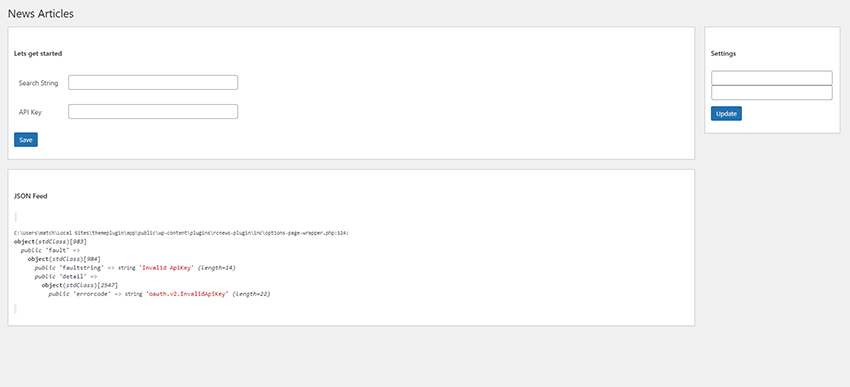

# New York Times Articles WordPress Plugin

With this plugin you can search for articles post on the new york times and display them on your wordpress site.

# Usauge

First install and active the plugin.

Then you will find the plugins settings page in wordpress settings -> News Articles.

Here you will need to add your API key and your search term.

The latest 10 articles with that search term will be displayed on the page.

To display the articles on pages you can use this shortcode [rcnews_articles] or the widget named NY Times Articles Widget

Shortcode options [rcnews_articles num_articles=3 display_image = 'off']

